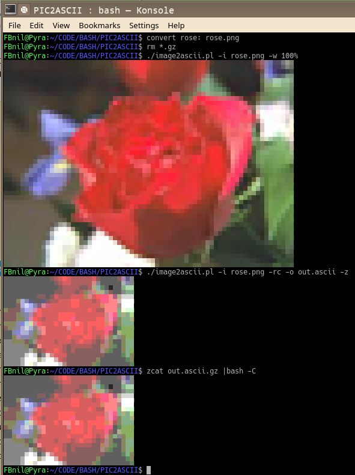

# image2ascii.pl
Convert an image, using ImageMagick to an ANSI colour image, which can be printed on a terminal. It does this by printing Unicode Character 
['LOWER HALF BLOCK'](https://www.fileformat.info/info/unicode/char/2584/index.htm) and grab 2 pixel rows to use as foreground and background color. 
With a little Perl to glue all together.

```
./image2ascii.pl <-i inputfile> [-o outputfile] [-r] [-c] [-z] [-v] [-w width]
 -i: inputfile (any non transparant image that convert can use)
 -w: Resize using width only (keeps aspect ratio). Use x16 for resized height
 -o: Optional outputfile
 -r: Use an RGB256 color palette. The default is TrueColor
 -c: Try to use less ANSI control characters resulting in a smaller file
 -z: Optionally gzip the outputfile.
 -x: Optional string to pass extra parameters to convert.
 -v: Verbose (use twice for more output)
```

A gzipped outputfile can be displayed using:  ```zcat outfile.ascii.gz  |bash -C```

## Dependencies
Uses "convert" from ImageMagick. Uses gzip (if -z is used). uses tr

## Usage Example

```bash
# Dump the example rose image from ImageMagick:
convert rose: rose.png
# Display it in TrueColor ANSI at the original size:
./image2ascii.pl -i rose.png -w 100%
# If that did not display, use 256 colors instead and resize to 32 pixels wide:
reset; ./image2ascii.pl -i rose.png -w 32 -r
```
### Visual Example


## Other similar projects

### [image-to-ansi](https://dom111.github.io/image-to-ansi/)
It's an online converter, but the resulting colors are sub-par.

## Algorithms used from others

* Uses color reduction algorithm from [QIX](https://github.com/Qix-/color-convert/blob/master/README.md)
